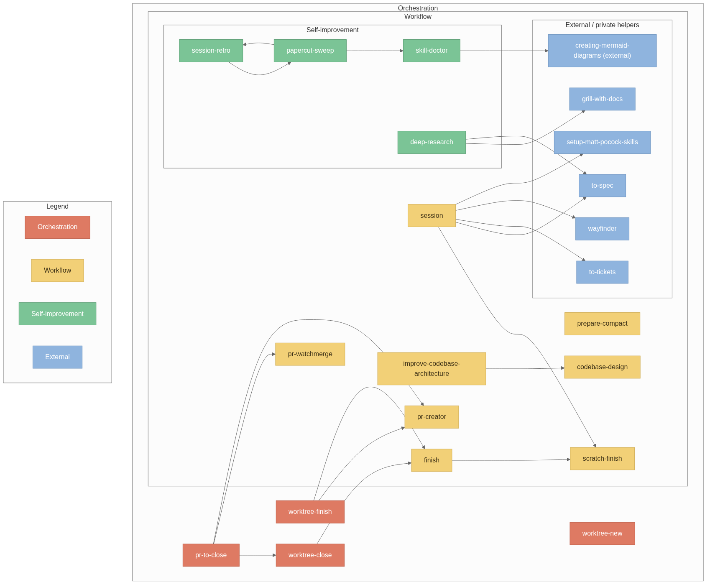
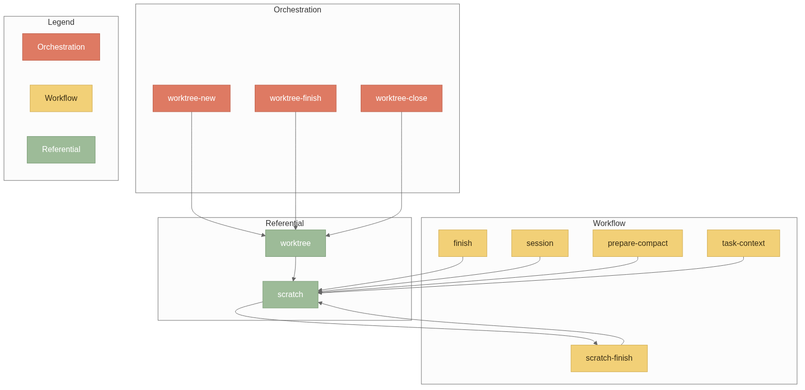

# agent

My personal OpenCode setup as one repo: skills, agent definitions, plugins,
and commands. The repo is the source of truth; copies are pushed into OpenCode
config dirs with `sync.sh`, so each target has a real copy (no symlinks).

## Install

```bash
./sync.sh push -g                # global (~/.config/opencode)
./sync.sh push ~/Notes           # project (<project>/.opencode)
./sync.sh diff -g                # preview drift (push + pull directions)
# --dry-run to preview; needs restart after
```

`sync.sh` copies `skills/ agents/ plugins/ commands/` (tracked in
`.agent-sync.json`); files that are not ours are left alone. Because installs
are copies, edits in the repo apply where they are pushed — run `./sync.sh push
-g` after changing anything. `pull` copies target edits back (existing files
only), `remove` uninstalls exactly what was pushed, and `all` runs across every
target in `targets.conf`.

Config roots shadow `~/.agents/skills` — delete shadowed npx copies when
`sync.sh` warns.

Requires [`creating-mermaid-diagrams`](https://github.com/Agents365-ai/creating-mermaid-diagrams) (`npx skills add Agents365-ai/365-skills -g`) for diagram export; `mattpocock/skills` for engineering workflows (see `~/.config/opencode/scripts/setup-skills.sh`). `papercuts` optional: `cargo install papercuts`.

## Skills

These split on how you'll reach for them — a guide, not hard rules about who may call what. In the repo they live under category subdirs (`skills/orchestration/…`); **`sync.sh` installs them flat** (`skills/<name>/`) because skill and agent IDs are path-derived.

- **Orchestration**: Large workflows you run manually. Runs other workflows
- **Workflow**: Workflows/procedures the agent runs. You can invoke them directly, but they're usually pulled in automatically by other skills. 
- **Referential**: Modular instructions and conventions other workflows load as dependencies. 
- **Standalone**: Standards and conventions the agent consults on its own to guide what it writes.

### Orchestration (you run these)

- **[pr-to-close](./skills/orchestration/pr-to-close/SKILL.md)**: Take a finished worktree branch all the way to done: open the PR, watch its CI and merge when green, then close the worktree.
- **[worktree-new](./skills/orchestration/worktree-new/SKILL.md)**: Start work on a task in a new git worktree branch, keeping untracked items (`.scratch/`, `.papercuts.jsonl`) on the main project dir.
- **[worktree-finish](./skills/orchestration/worktree-finish/SKILL.md)**: Finish a worktree's pull request safely: conflict resolution, readiness checks, and asking before behavior-changing resolutions.
- **[worktree-close](./skills/orchestration/worktree-close/SKILL.md)**: Finish a worktree session (finish workflow) and clean up the worktree and its branch.

### Workflow (usually agent-run, yours to trigger too)

- **[pr-creator](./skills/workflow/pr-creator/SKILL.md)**: Create PRs following the repo's own template and standards; never from the default branch.
- **[pr-watchmerge](./skills/workflow/pr-watchmerge/SKILL.md)**: Watch a PR's CI checks and merge automatically once they pass.
- **[finish](./skills/workflow/finish/SKILL.md)**: End a session: update docs, propose grouped commits, archive a completed `.scratch/` workspace, summarize.
- **[session](./skills/workflow/session/SKILL.md)**: Manage a feature's session workspace: plan/spec doc, tickets, deviation log, checkpoints.
- **[workflows](./skills/workflow/workflows/SKILL.md)**: The orchestrator's concrete workflows and subagent routing table; loaded before any routing decision.
- **[scratch-finish](./skills/workflow/scratch-finish/SKILL.md)**: Archive a completed `.scratch/` workspace: the completion checklist and archive steps.
- **[prepare-compact](./skills/workflow/prepare-compact/SKILL.md)**: Prepare a session for context compaction: persist state, then clear the goal. Best used with the [opencode-context-watch plugin](https://github.com/FAZuH/opencode-context-watch/).
- **[deep-research](./skills/workflow/deep-research/SKILL.md)**: Investigate against primary sources and capture findings as a single Markdown file; wraps `mattpocock/skills` research methodology via the `research` subagent.
- **[papercut-sweep](./skills/workflow/papercut-sweep/SKILL.md)**: Sweep the global papercuts backlog (`self::` entries) and apply approved self-improvement drafts.
- **[session-retro](./skills/workflow/session-retro/SKILL.md)**: End-of-session retrospective — files `self::` proposals without touching code.
- **[skill-doctor](./skills/workflow/skill-doctor/SKILL.md)**: Audit the skill/agent relation graph (`loads`/`routes`/`documents`), flag `broken-ref`/`collision`/`drift`, optionally render via `creating-mermaid-diagrams`.
- **[teach](./skills/workflow/teach/SKILL.md)**: Teach anything so it locks in: graded quizzes probe your level, then a dependency map is taught node by node. Ported from [amosblomqvist/learn](https://github.com/amosblomqvist/learn).
- **[visualize](./skills/workflow/visualize/SKILL.md)**: Adds a correct, minimal diagram to a lesson when an idea is clearer as a picture; briefs a maker subagent that renders and verifies the image.

### Referential (loaded by other skills while they run)

- **[following-procedures](./skills/referential/following-procedures/SKILL.md)**: How to run a numbered procedure without skipping steps: point-and-call narration, live deviation logging, and a post-run report. Every procedural skill above loads it first.
- **[scratch](./skills/referential/scratch/SKILL.md)**: The `.scratch/` workspace mechanics: slug format, layout, lifecycle.
- **[worktree](./skills/referential/worktree/SKILL.md)**: Work on a branch in a separate git worktree.

### Standalone (consulted on their own)

- **[test-guidelines](./skills/standalone/test-guidelines/SKILL.md)**: Test writing guidelines: validity, isolation, determinism, test doubles, anti-patterns, coverage.
- **[gui-test-guidelines](./skills/standalone/gui-test-guidelines/SKILL.md)**: GUI/E2E test automation guidelines: selectors, Page Object, visual regression, accessibility.
- **[error-message](./skills/standalone/error-message/SKILL.md)**: Write/review error message strings per std-library conventions.
- **[logging-guidelines](./skills/standalone/logging-guidelines/SKILL.md)**: Structured logging with wide events, correlation, and safe redaction.
- **[design-tradeoffs](./skills/standalone/design-tradeoffs/SKILL.md)**: Compare design options with structured tradeoff analysis.
- **[scheduled-task](./skills/standalone/scheduled-task/SKILL.md)**: Manage scheduled tasks with systemd user timers (`octask` CLI on `$PATH` — add/remove/list/enable/disable/status/logs; `octask-` prefixed units, OnCalendar validation).
- **[scheduled-agent](./skills/standalone/scheduled-agent/SKILL.md)**: Schedule unattended agent runs on user timers (`octask add --agent ...`), with a deny-all-by-default restricted agent template.
- **[issue-closeout](./skills/standalone/issue-closeout/SKILL.md)**: Link merged PRs to resolved issues — closeout comment with PR/SHA, close issues where `Closes #N` does not fire.
- **[oop](./skills/standalone/oop/SKILL.md)**: Standard OOP/architecture vocabulary — principles, smells, patterns, and metrics. Use when you want findings, reviews, or design discussions phrased in OOP terms ("use oop terms").
- **[improve-architecture-oop](./skills/standalone/improve-architecture-oop/SKILL.md)**: OOP vocabulary overlay for `improve-codebase-architecture` findings and diagrams (loads `oop`).

## Agents

Agent definitions grouped by role in `agents/<category>/` (installed flat as
`agents/<name>.md`). IDs are path-derived, so the flat install keeps the names
the orchestrator and subagent tool reference.

| Category | Agents |
| --- | --- |
| `primary` | **[orchestrator](./agents/primary/orchestrator.md)** (routes work to subagents), [autocommit](./agents/primary/autocommit.md) (unattended conventional commits; deny-all permissions), [chat](./agents/primary/chat.md), [tutor](./agents/primary/tutor.md) |
| `build` | [implement](./agents/build/implement.md), [test](./agents/build/test.md), [dev-server](./agents/build/dev-server.md) |
| `review` | [review](./agents/review/review.md), [malware-check](./agents/review/malware-check.md), [pii-check](./agents/review/pii-check.md) |
| `research` | [research](./agents/research/research.md) (discovery + deep research), [researcher](./agents/research/researcher.md) (web synthesis) |
| `vision` | [image-viewer](./agents/vision/image-viewer.md), [web-viewer](./agents/vision/web-viewer.md), [mermaid-maker](./agents/vision/mermaid-maker.md), [svg-maker](./agents/vision/svg-maker.md) |
| `document` | [document](./agents/document/document.md), [finish](./agents/document/finish.md) |

The learning system (ported from oc-learn) supplies the visual makers
(`mermaid-maker`, `svg-maker`) and the `teach`/`visualize` skills.

## Plugins

- `plugins/mermaid/` — `mermaid-compile` + `mermaid-doctor` tools (fazuh.mermaid)
- `plugins/quiz/` — graded `quiz_ask` / `quiz_grade` pair (fazuh.quiz)
- `plugins/md-link/` — live-mirror a session to a markdown file (fazuh.md-link; TUI: `ctrl+alt:m` / `/md-link`)
- `plugins/viz/` — `write_*/edit_*/render_*` authoring loops + `/viz-dir` (fazuh.viz)
- `plugins/tui/` — TUI discovery shims for md-link/viz (see its README: the CLI loads local TUI modules only from this scan dir)

### Dependency Diagrams





## License

MIT
