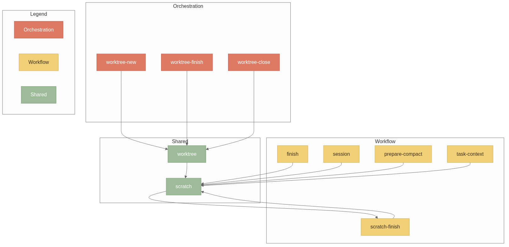
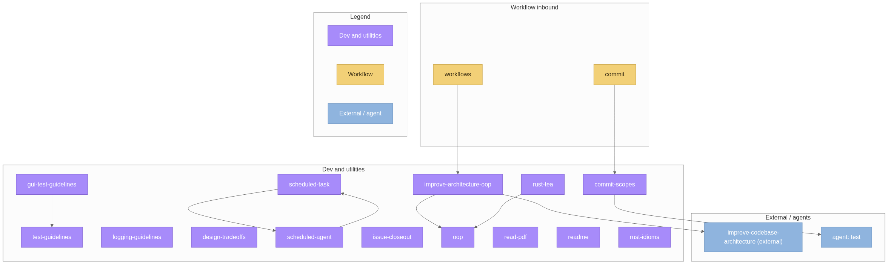

# agent

My personal OpenCode setup: skills, agent definitions, plugins, and commands. Copies are pushed into OpenCode config dirs with `sync.sh`.

## Install

Run the installer from the repository root:

```bash
./install.sh
```

The required install:

- verifies that OpenCode v2 and the required commands are available;
- installs the `mermaid-skill`, Matt Pocock engineering and productivity skills, `simple-english`, and `papercuts`;
- initializes the repository submodules;
- installs the local Rust workspace under `scripts/` with Cargo;
- creates `.agent-values` when it is missing, then pushes the repository skills, agents, plugins, commands, and scripts to the global OpenCode config.

Use the bonus option to add the optional skills as well:

```bash
./install.sh -b
```

The bonus install adds:

- `miqdadbadjuber/anti-slop` for filtering generic AI-generated UI and copy;
- `kajisho5/ffmpeg-skill` through its manual upstream copy fallback;
- an `ffmpeg` command check because the skill edits media locally.

The installer checks system tools but does not install operating-system packages or use `sudo`. Install missing system tools first, then rerun it.

## Uninstall

Run the uninstaller from the repository root:

```bash
./uninstall.sh
```

The default removes this repository's sync-managed skills, agents, plugins, commands, and scripts. It also removes the local Cargo package `agent`, which provides `octask`, `phone-digest`, and `mail-digest`.

It keeps OpenCode, `papercuts`, external skills, operating-system packages, and the repository checkout. Use `--dry-run` to preview the cleanup. Pass `--external-packages` to remove `papercuts` as well, or `--external-skills` to remove the external skills installed by `install.sh`.

After editing the repository, push the changed copies with:

```bash
./sync.sh push -g
```

Use `./sync.sh --help` for selective tags, project targets, templates, and other deployment options.

## Skills

These split by what they do, not by how they are loaded. **`sync.sh` installs them flat** (`skills/<name>/`) because skill and agent IDs are path-derived.

- **Orchestration**: Controls, delegates, tracks, and finishes agent work
- **Workflow**: Repeatable procedures with a defined process
- **Dev**: Engineering guidelines and conventions
- **Utils**: General machine and tool helpers
- **Meta**: Agent-system and repository maintenance
- **Shared**: Cross-cutting rules and mechanics
- **OpenCode v2**: OpenCode v2 operations

### Orchestration

- **[orchestrate](./skills/orchestration/orchestrate/SKILL.md)**: Manage tasks, delegation, permissions, run mode, and subagent session reuse.
- **[workflows](./skills/orchestration/workflows/SKILL.md)**: Select the concrete workflow and subagent route for a task.
- **[forkflow](./skills/orchestration/forkflow/SKILL.md)**: Warm per-ticket delegation with OpenCode v2 forks.
- **[session](./skills/orchestration/session/SKILL.md)**: Manage the feature session workspace, spec, tickets, deviations, and checkpoints.
- **[task-context](./skills/orchestration/task-context/SKILL.md)**: Create per-ticket context packets for workers.
- **[prepare-compact](./skills/orchestration/prepare-compact/SKILL.md)**: Persist session state before context compaction.
- **[finish](./skills/orchestration/finish/SKILL.md)**: End a session, archive its workspace, summarize, and route closeout.
- **[self-improve](./skills/orchestration/self-improve/SKILL.md)**: Run the gated retrospective and skill-system improvement check.
- **[session-retro](./skills/orchestration/session-retro/SKILL.md)**: Propose self-improvement lessons after a session.
- **[papercut-sweep](./skills/orchestration/papercut-sweep/SKILL.md)**: Sweep approved global self-improvement entries.
- **[long-horizon](./skills/orchestration/long-horizon/SKILL.md)**: Keep long-running agent work alive with supervisors and heartbeats.
- **[offload](./skills/orchestration/offload/SKILL.md)**: Move builds, checks, and agent batches to remote machines.
- **[scratch-finish](./skills/orchestration/scratch-finish/SKILL.md)**: Archive a completed `.scratch/` workspace.
- **[worktree-new](./skills/orchestration/worktree-new/SKILL.md)**: Start isolated work in a new git worktree.
- **[worktree-finish](./skills/orchestration/worktree-finish/SKILL.md)**: Prepare a worktree branch and its pull request for merge.
- **[worktree-close](./skills/orchestration/worktree-close/SKILL.md)**: Finish a worktree session and remove the worktree and branch.
- **[pr-to-close](./skills/orchestration/pr-to-close/SKILL.md)**: Take a finished worktree branch through PR creation, merge, and cleanup.

### Workflow

- **[changelog](./skills/workflow/changelog/SKILL.md)**: Create or update the changelog for the next version.
- **[commit](./skills/workflow/commit/SKILL.md)**: Plan commit grouping and propose conventional commit messages.
- **[deep-research](./skills/workflow/deep-research/SKILL.md)**: Investigate a narrow external question and capture one cited findings file.
- **[issue-closeout](./skills/workflow/issue-closeout/SKILL.md)**: Link merged pull requests to resolved issues and close them where needed.
- **[pr-creator](./skills/workflow/pr-creator/SKILL.md)**: Create a pull request using the repository's standards and template.
- **[pr-watchmerge](./skills/workflow/pr-watchmerge/SKILL.md)**: Watch pull request checks and merge once they pass.
- **[setup-dev-docs](./skills/workflow/setup-dev-docs/SKILL.md)**: Bootstrap, audit, or update durable `docs/dev/` documentation.
- **[teach](./skills/workflow/teach/SKILL.md)**: Run the multi-session teaching workflow, including probing, planning, quizzes, and durable lesson records.
- **[visualize](./skills/workflow/visualize/SKILL.md)**: Create one correct, minimal visual artifact and verify it after rendering.

### Dev

- **[comments](./skills/dev/comments/SKILL.md)**: Write useful comments without narration or change-history noise.
- **[commit-scopes](./skills/dev/commit-scopes/SKILL.md)**: Create and maintain the closed vocabulary for Conventional Commit scopes.
- **[design-tradeoffs](./skills/dev/design-tradeoffs/SKILL.md)**: Compare design options with structured tradeoffs.
- **[gui-test-guidelines](./skills/dev/gui-test-guidelines/SKILL.md)**: Write reliable GUI, browser, and accessibility tests.
- **[improve-architecture-oop](./skills/dev/improve-architecture-oop/SKILL.md)**: Apply the OOP vocabulary to architecture analysis and reports.
- **[logging-guidelines](./skills/dev/logging-guidelines/SKILL.md)**: Design structured logs, safe redaction, correlation, and useful events.
- **[oop](./skills/dev/oop/SKILL.md)**: Use standard OOP and architecture vocabulary.
- **[readme](./skills/dev/readme/SKILL.md)**: Standardize README structure and house style.
- **[rust-idioms](./skills/dev/rust-idioms/SKILL.md)**: Apply type-driven Rust design patterns.
- **[rust-tea](./skills/dev/rust-tea/SKILL.md)**: Design Rust UIs with TEA/MVU architecture.
- **[secrets-argv](./skills/dev/secrets-argv/SKILL.md)**: Keep secrets out of process arguments, history, logs, and transcripts.
- **[test-guidelines](./skills/dev/test-guidelines/SKILL.md)**: Write focused, deterministic, meaningful tests.

### Utils

- **[notes](./skills/utils/notes/SKILL.md)**: Read and maintain durable notes for tools, CLIs, APIs, scheduled agents, and OpenCode behavior.
- **[omarchy-plugin-install](./skills/utils/omarchy-plugin-install/SKILL.md)**: Install an Omarchy shell plugin end to end, including malware review and dotfiles persistence.
- **[plan-confirm](./skills/utils/plan-confirm/SKILL.md)**: Present large plans or audits for grouped confirmation.
- **[read-pdf](./skills/utils/read-pdf/SKILL.md)**: Read PDFs and extract text, tables, images, and structured data.
- **[scheduled-agent](./skills/utils/scheduled-agent/SKILL.md)**: Schedule restricted unattended agents with systemd user timers.
- **[scheduled-task](./skills/utils/scheduled-task/SKILL.md)**: Manage scheduled tasks with `octask` and systemd user timers.

### Meta

- **[agent-map](./skills/meta/agent-map/SKILL.md)**: Map and maintain this personal-public agent repository.
- **[external-skills](./skills/meta/external-skills/SKILL.md)**: Install, update, list, or remove upstream-owned skills.
- **[skill-doctor](./skills/meta/skill-doctor/SKILL.md)**: Audit skill references, names, collisions, and source drift.

### Shared

- **[following-procedures](./skills/shared/following-procedures/SKILL.md)**: Run numbered procedures without skipping steps.
- **[gate](./skills/shared/gate/SKILL.md)**: Define approval gates, run modes, and the `GATE` tag format.
- **[scratch](./skills/shared/scratch/SKILL.md)**: Define the `.scratch/` workspace lifecycle and layout.
- **[worktree](./skills/shared/worktree/SKILL.md)**: Define safe git worktree creation and cleanup mechanics.

### OpenCode v2

- **[ocv2-api](./skills/ocv2/ocv2-api/SKILL.md)**: Use `opencode2 api` to call the v2 HTTP API.
- **[ocv2-compact](./skills/ocv2/ocv2-compact/SKILL.md)**: Compact a v2 session and wait for its summary.
- **[ocv2-models](./skills/ocv2/ocv2-models/SKILL.md)**: Pick and switch models through the v2 API.
- **[ocv2-sessions](./skills/ocv2/ocv2-sessions/SKILL.md)**: Fork and control OpenCode v2 sessions.
- **[ocv2-move](./skills/ocv2/ocv2-move/SKILL.md)**: Move an OpenCode v2 session to another project directory.
- **[ocv2-pluginhealth](./skills/ocv2/ocv2-pluginhealth/SKILL.md)**: Inspect plugin status and errors.
- **[ocv2-unfuck](./skills/ocv2/ocv2-unfuck/SKILL.md)**: Verify top-level tool availability before claiming restricted mode.

## Agents

Agent definitions grouped by role in `agents/<category>/` (installed flat as
`agents/<name>.md`). IDs are path-derived, so the flat install keeps the names
the orchestrator and subagent tool reference.

| Category | Agents |
| --- | --- |
| `primary` | **[orchestrator](./agents/primary/orchestrator.md)** (routes work to subagents), [autocommit](./agents/primary/autocommit.md) (unattended conventional commits; ask-by-default permissions), [chat](./agents/primary/chat.md), [tutor](./agents/primary/tutor.md) |
| `build` | [implement](./agents/build/implement.md) (implementation, verification, dev servers) |
| `review` | [review](./agents/review/review.md), [malware-check](./agents/review/malware-check.md), [pii-check](./agents/review/pii-check.md) |
| `research` | [research-discovery](./agents/research/research-discovery.md) (codebase mapping + primary-source findings), [research-synthesis](./agents/research/research-synthesis.md) (web research brief) |
| `vision` | [image-viewer](./agents/vision/image-viewer.md), [web-viewer](./agents/vision/web-viewer.md), [mermaid-maker](./agents/vision/mermaid-maker.md), [svg-maker](./agents/vision/svg-maker.md) |
| `document` | [document](./agents/document/document.md) |

The visual workflow uses the `mermaid-maker` and `svg-maker` agents. The
`teach` workflow uses the tutor and lesson-record system.

## Plugins

- `plugins/mermaid/` - `mermaid-compile` + `mermaid-doctor` tools (fazuh.mermaid)
- `plugins/md-link/` - live-mirror a session to a markdown file (fazuh.md-link; TUI: `ctrl+alt:m` / `/md-link`)
- `plugins/viz/` - `write_*/edit_*/render_*` authoring loops + `/viz-dir` (fazuh.viz)

A plugin that adds TUI commands ships a file named `tui.ts` at its own
directory root; the CLI resolves the TUI entry as `<plugin-dir>/tui` and loads
nothing otherwise.

### Dependency Diagrams






## License

MIT
