# Skill Guide

Skills by the phase of the work they serve. Find the phase, load only what that
phase lists, and stop.

- A skill is listed once. Cross-phase tools live under **Any time**.
- Order inside a phase is a suggestion, not a gate. `gate` decides what waits
  for a human.
- Names in **bold** are skills. The repository's own inventory, with one line
  each, is in [Skills](skills.md); the rest are installed by `install.sh`.

- [Flow](#flow) — the phase chain and its two loops
- [Phases](#phases) — what each phase settles, and the skills for it
- [Any time](#any-time) — legal in every phase
- [Common workflows](#common-workflows) — the named composites of the phases

The eight phases, in order:

| Phase | What it settles |
| --- | --- |
| [Frame](#frame) | Understand the task before touching anything |
| [Decide](#decide) | Settle the design before code exists |
| [Isolate](#isolate) | Give the work its own branch, workspace, and context |
| [Build](#build) | Write the thing |
| [Verify](#verify) | Make the checks mean the same thing here and on the runner |
| [Review](#review) | Standards and spec, read side by side |
| [Ship](#ship) | Branch to merged |
| [Close](#close) | Commit, document, archive, improve |

## Flow

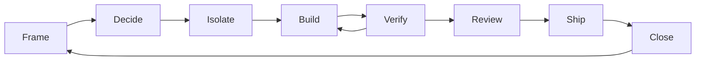

`Verify` loops back to `Build` until the checks agree, `Review` sends fixes back
the same way, and `Close` hands the next ticket back to `Frame`.

## Phases

### Frame

Understand the task before touching anything.

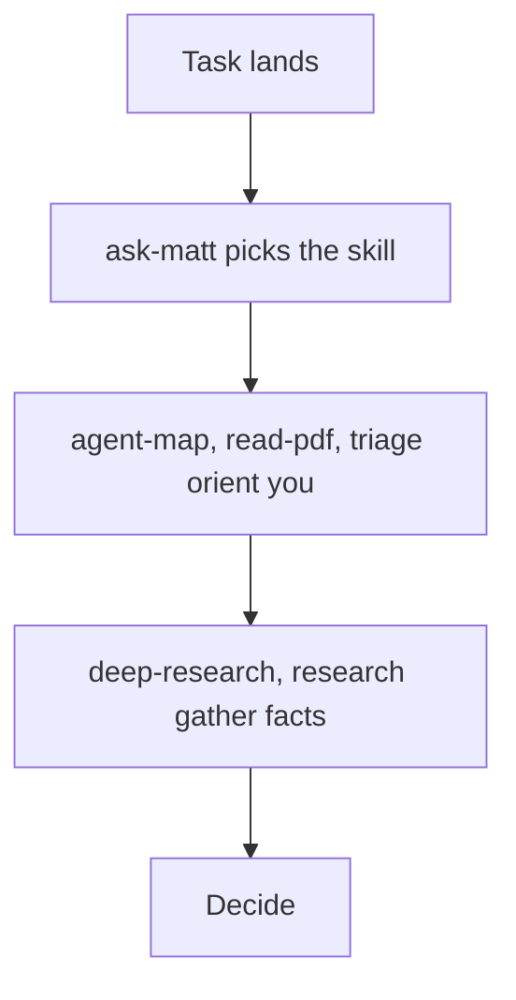

- **ask-matt** — which existing skill or flow fits this situation.
- **agent-map** — where an item belongs in this repository and which rules it follows.
- **read-pdf** — pull text, tables, or figures out of a spec or a paper.
- **triage** — move an issue or an external pull request to a state where an agent can pick it up.
- **setup-matt-pocock-skills** — one-time tracker and doc layout setup.
- **deep-research** — one narrow external question, one cited findings file.
- **research** — the same method, delegated to a background agent.

`orchestrate` and `workflows` do the routing itself, and are listed under
[Any time](#any-time).

### Decide

Settle the design before code exists.

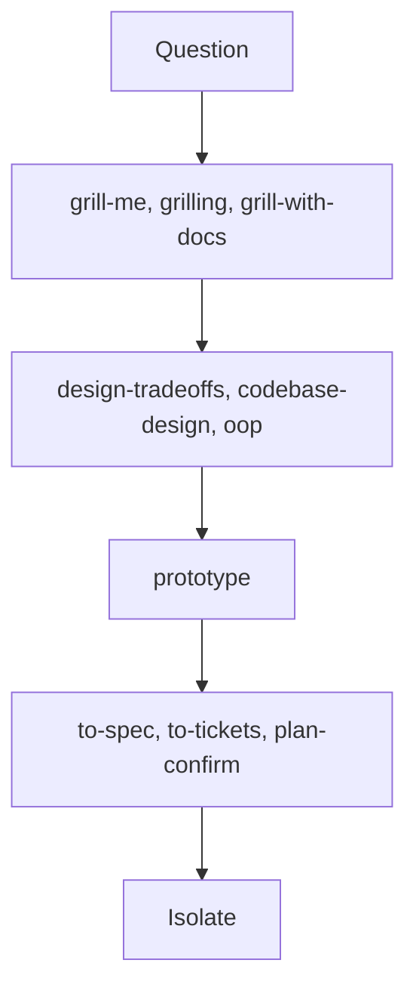

- **grill-me**, **grilling**, **grill-with-docs** — be grilled until the plan survives; the last one writes ADRs and a glossary as it goes.
- **design-tradeoffs** — compare options on a fixed set of axes.
- **codebase-design** — module interfaces, seams, and deepening opportunities.
- **oop**, **improve-architecture-oop** — the shared vocabulary for talking about structure.
- **improve-codebase-architecture** — scan for deepening candidates, then grill the one you pick.
- **domain-modeling** — sharpen the terms, and record the decisions.
- **prototype** — a throwaway build to answer a design question.
- **to-spec**, **to-tickets** — write the plan up, then split it into tracer-bullet tickets.
- **wayfinder** — a decision map for work larger than one session.
- **to-questionnaire** — hand a decision you cannot make to someone else.
- **plan-confirm** — present a long plan for grouped accept, reject, or defer.

### Isolate

Give the work its own branch, workspace, and context.

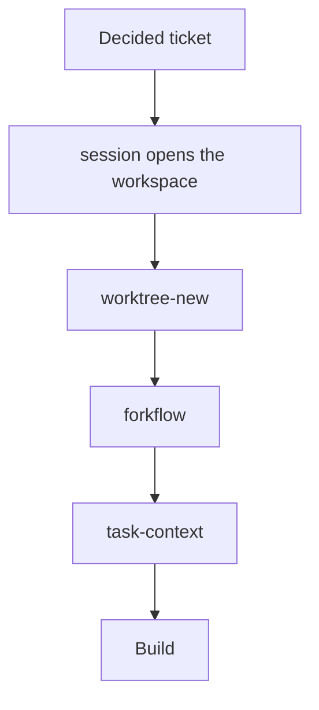

- **session** — the `.scratch/` workspace: spec, tickets, deviations, checkpoints.
- **scratch** — the workspace layout and lifecycle those files follow.
- **worktree** — safe creation and cleanup mechanics.
- **worktree-new** — an isolated branch in a separate worktree.
- **forkflow** — a warm fork of a finished session, so the child already has the context.
- **task-context** — the context packet a worker agent needs before it starts.

### Build

Write the thing.

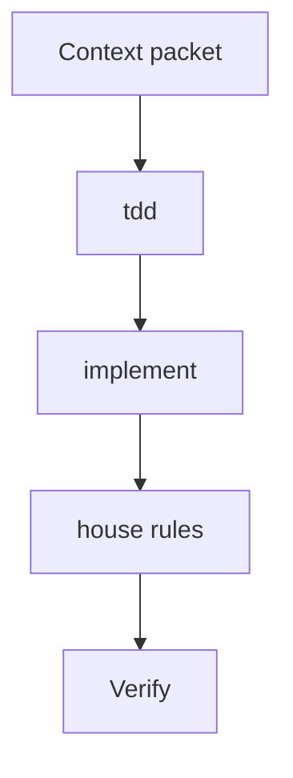

- **tdd** — the test first, then the smallest code that passes.
- **implement** — the implementation procedure, delegated to the build agent.
- **test-guidelines** — what a focused, deterministic, meaningful test looks like.
- **rust-idioms**, **rust-tea** — type-driven Rust design, and TEA/MVU for Rust UIs.
- **logging-guidelines** — canonical log lines, redaction, correlation, sampling.
- **secrets-argv** — keep credentials out of argv, history, logs, and transcripts.
- **guarding-destructive-operations** — refuse instead of warn on delete, reset, and history-rewrite paths.
- **verifying-external-behavior** — probe the library or API before you depend on it.
- **shipping-build-artifacts** — make the build step a real gate on what ships.
- **comments** — comments that earn their place.
- **wizard** — a script that walks a human through the steps only they can do.
- **ffmpeg-skill** — cut, caption, convert, and normalise local media.

### Verify

Make the checks mean the same thing here and on the runner.

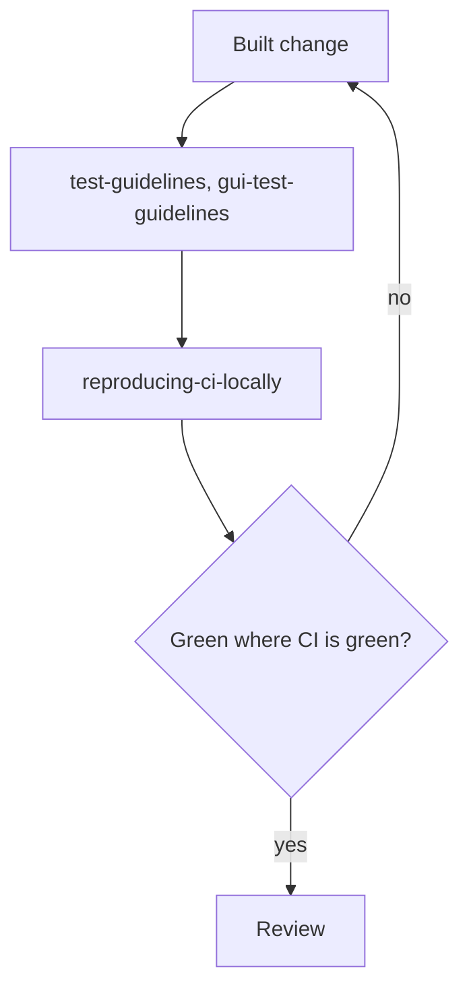

- **gui-test-guidelines** — selectors, synchronization, visual and accessibility checks.
- **reproducing-ci-locally** — derive the exact CI command from the workflow file, then run that.
- **diagnosing-bugs** — the loop for a hard bug or a performance regression.

### Review

Standards and spec, read side by side.

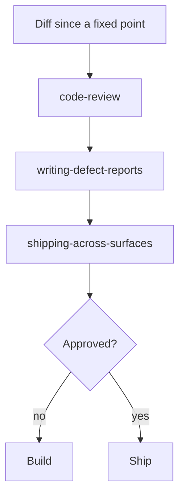

- **code-review** — the Standards axis and the Spec axis, side by side.
- **writing-defect-reports** — establish a finding before you publish it, and correct it after.
- **shipping-across-surfaces** — land the same fact everywhere it is stated.

### Ship

Branch to merged.

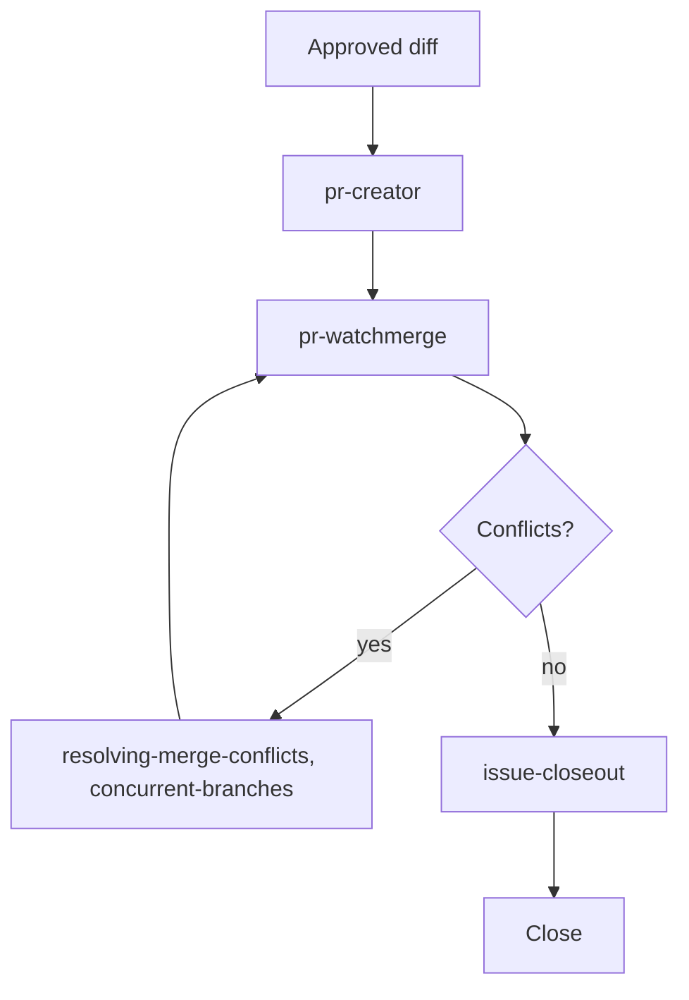

- **pr-creator** — the pull request, using the repository's own template and checks.
- **pr-watchmerge** — watch the checks and merge when they pass.
- **pr-to-close** — the whole worktree lifecycle: create, merge, clean up.
- **resolving-merge-conflicts** — the mechanics of an in-progress merge or rebase.
- **concurrent-branches** — resolve several open branches against one repository.
- **issue-closeout** — link the merge back to the issues it fixed, and close them.
- **ci-pipeline-synthesizer** — author or update a GitHub Actions pipeline.
- **running-github-actions-efficiently** — cut CI minutes and wall-clock time.

### Close

Commit, document, archive, improve.

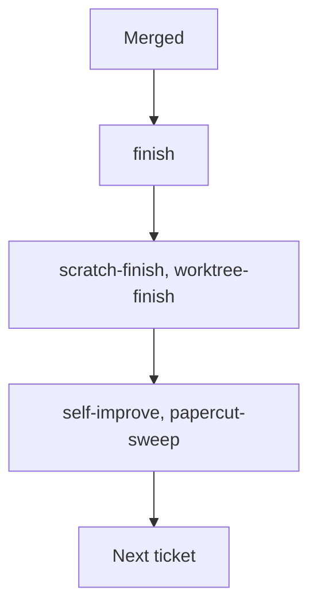

- **finish** — the end-of-session workflow: docs, commit grouping, summary, next steps.
- **scratch-finish** — archive a finished `.scratch/` workspace.
- **worktree-finish**, **worktree-close** — prepare the branch for merge, then remove the worktree and the branch.
- **commit**, **commit-scopes** — group the commits and use the closed scope vocabulary.
- **changelog** — the release notes for the next version.
- **readme** — README structure and house style.
- **setup-dev-docs** — bootstrap, audit, or refresh `docs/dev/`.
- **session-retro** — propose lessons from the session that just ended.
- **self-improve** — the gated retrospective and skill check.
- **papercut-sweep** — apply the approved self-improvement backlog.

## Any time

Legal in every phase. Load them when their condition holds, not on a schedule.
Long work also checkpoints through `session`, which [Isolate](#isolate) sets
up.

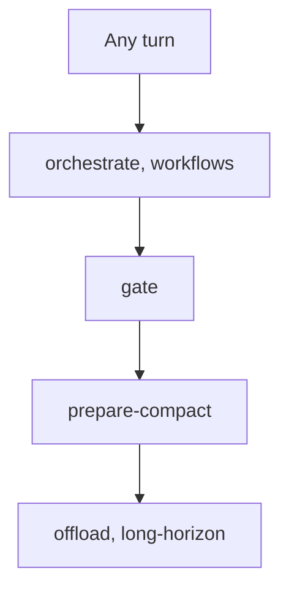

- **orchestrate** — the orchestrator role: delegation, permissions, run mode, subagent reuse.
- **workflows** — the routing table that turns a task into a workflow and a subagent.
- **gate** — approval gate classes and the `GATE` tag.
- **following-procedures** — run a numbered procedure without skipping a step.
- **prepare-compact** — persist state before the context window runs out.
- **offload** — move builds, checks, and agent batches to a remote machine.
- **long-horizon** — supervisors and heartbeats that keep overnight work alive.
- **notes** — durable notes for tools, CLIs, APIs, scheduled agents, and OpenCode behaviour.
- **skill-doctor** — audit skill links, name collisions, and drift from the source.
- **external-skills** — install, update, or remove upstream-owned skills.
- **scheduled-task**, **scheduled-agent** — systemd user timers and the restricted agents they run.
- **omarchy-plugin-install** — install an Omarchy shell plugin end to end.
- **simple-english** — plain, layman-readable prose for readers outside the field.
- **writing-for-agents** — structure for skills, agent definitions, and `AGENTS.md`.
- **antislop** and **antislop-code**, **-copywriting**, **-human**, **-layoutmobile**, **-ui** — the anti-slop filter for generic AI output.
- **visualize**, **show-me**, **mermaid-skill** — one correct visual when a picture carries the idea.
- **teach** — the multi-session teaching workflow, with quizzes and durable lesson records.
- **handoff**, **wait-what** — compact the session for another agent, or re-pitch the last answer.
- **ocv2-api**, **ocv2-compact**, **ocv2-models**, **ocv2-sessions**, **ocv2-move**, **ocv2-pluginhealth**, **ocv2-unfuck** — the OpenCode v2 operations.

## Common workflows

Named composites of the phases above. Pick the one that matches the job. Every
node is a skill, in the order it fires; an edge label marks the one step that
is not a skill.

### Ticket to merged

The default path for a feature or a fix that has a ticket.

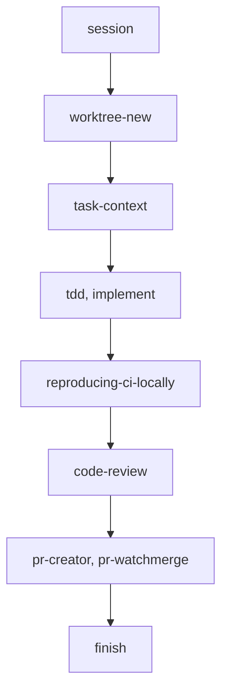

- **session** holds the spec, the tickets, and the deviation log for the whole path.
- **finish** runs last, not first: it commits the merged result, not the work in progress.
- **pr-to-close** is this path with the worktree steps already wired together.

### Worktree lifecycle

An isolated branch that ends as a merged pull request and leaves nothing behind.

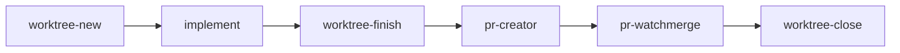

- **worktree-finish** takes the branch from ready to mergeable; **worktree-close** removes the worktree and the branch.
- **pr-to-close** runs the whole lifecycle for you when the branch is already done.

### Changing this repository

Adding or editing a skill, an agent, a plugin, or a command.

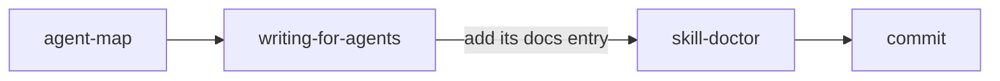

- **agent-map** decides which source directory the item belongs in.
- **simple-english** and **readme** cover the prose and the front door.
- `sync.sh` never deploys a hand-edited target copy; edit here, then push.

### Unattended or overnight run

Work that continues without you at the keyboard.

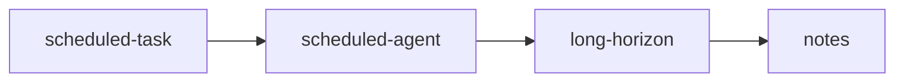

- **scheduled-agent** — a deny-by-default agent definition, so a timer cannot do more than it was given.
- **long-horizon** — health-gated restarts and a heartbeat that wakes the orchestrator.
- **offload** — move the heavy build or the agent batch to a remote machine first.

